# Learning Stochastic Multiscale Models

This repository accompanies the paper "Learning Stochastic Multiscale Models" currently under consideration for NeurIPS 2025. It contains the training scripts and results for all test cases presented therein.

All cases were trained with Adam. Details of training procedure for each case can be found in the `experiments` directory.

For each test case, we begin by training an implicit-scale model with an initial learning rate of $10^{-3}$. We decay the learning rate by $10\%$ every 2000 optimization steps. We then initialize the multiscale model with $n_\eta = 1$ using trained parameters from the implicit-scale model; we apply Xavier normal initialization to all new parameters. We train it with an initial learning rate of $10^{-4}$. This process is repeated for larger $n_\eta$.

Implicit-scale and multiscale models are assessed with the normalized error metric $\epsilon(t_i) = \|y_i - \hat{y}(t_i)\|/\|y_i\|$, where $y_i$ is the observation at time $t_i$ and $\hat{y}(t_i)$ is the mean prediction. For each experiment, we report the mean $\pm$ standard deviation of $\epsilon$ samples on the test set.

Dependencies are handled with [Poetry](https://github.com/python-poetry/poetry) and listed in `pyproject.toml`.

## 1D Korteweg - de Vries Equation

Korteweg - de Vries equation multi-trajectory dataset. Training set contains 10 trajectories, validation contains 5, test contains 5. Trained for 200 epochs.
- Original resolution: $n_y = 1000$
- Macroscale resolution: $n_\zeta = 20$
- Microscale dimension: $n_\eta \in \{1, ..., 5\}$

### Baseline implicit-scale model

Error on test set: $0.317 \pm 0.099$

<div align="center">

<table>
  <tr>
    <td align="center" width="20%">
      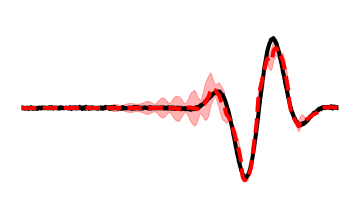<br/>
      <sub>Time = 0.0</sub>
    </td>
    <td align="center" width="20%">
      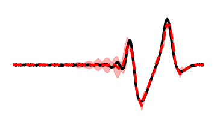<br/>
      <sub>Time = 0.25</sub>
    </td>
    <td align="center" width="20%">
      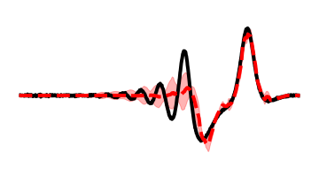<br/>
      <sub>Time = 0.5</sub>
    </td>
    <td align="center" width="20%">
      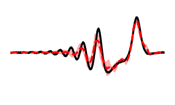<br/>
      <sub>Time = 0.75</sub>
    </td>
    <td align="center" width="20%">
      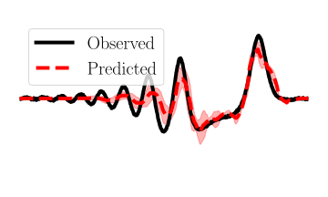<br/>
      <sub>Time = 1.0</sub>
    </td>
  </tr>
</table>

</div>

If the above plots are not rendering, view them [here.](images/kdv_1d/20_0_200_0.001_2000_3/)

### Multiscale model ($n_\eta = 5$)

Error on test set: $0.044 \pm 0.017$

<div align="center">

<table>
  <tr>
    <td align="center" width="20%">
      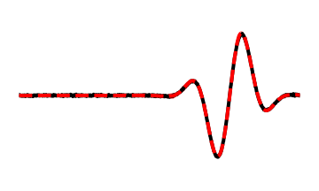<br/>
      <sub>Time = 0.0</sub>
    </td>
    <td align="center" width="20%">
      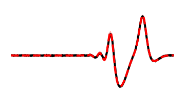<br/>
      <sub>Time = 0.25</sub>
    </td>
    <td align="center" width="20%">
      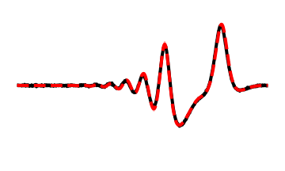<br/>
      <sub>Time = 0.5</sub>
    </td>
    <td align="center" width="20%">
      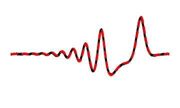<br/>
      <sub>Time = 0.75</sub>
    </td>
    <td align="center" width="20%">
      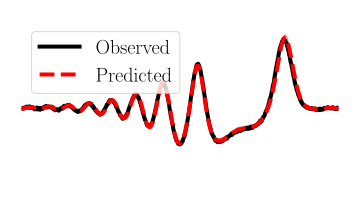<br/>
      <sub>Time = 1.0</sub>
    </td>
  </tr>
</table>

</div>

If the above plots are not rendering, view them [here.](images/kdv_1d/20_5_200_0.0001_2000_3_augment/)

### Generating data

The dataset is generated by the `gen_data.py` script in the directory `experiments/kdv_1d`. After it finishes running, it produces a file `data_10_5_5.pkl`. This will be the dataset our model trains on.

### Training and evaluation

To train a model on this dataset and assess the error, first navigate to the top-level directory `multiscale-visde`, add the pwd to the `PYTHONPATH` environment variable, then execute the following:
```
poetry run python experiments/kdv_1d/run_visde.py
```
This will create a log directory `logs_visde` with model checkpoints. Once training is done, reported error will appear in the directory `postproc_visde`, plots comparing model predictions to observations will appear in `plot_visde`, and plots showing the scale separation will appear in `msplot_visde`. These output folders already contain the results for all test cases reported in the paper. Model hyperparameters and architecture may be modified in `run_visde.py` and `def_model.py` if desired.

## 2D Burgers' Equation

2D Burgers' equation multi-trajectory dataset. Training set contains 20 trajectories, validation contains 5, test contains 5. Trained for 100 epochs.
- Original resolution: $n_y = 128 \times 128 = 16384$
- Macroscale resolution: $n_\zeta = 8 \times 8 = 64$
- Microscale dimension: $n_\eta \in \{1, ..., 5\}$

### Baseline implicit-scale model

Error on test set: $0.127 \pm 0.040$

<p align="center">
  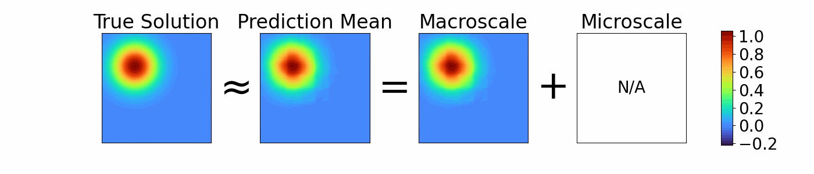
</p>

If the above gif is not rendering, view it [here.](images/burgers_2d/64_0_100_0.001_2000/test_multiscale.gif)

### Multiscale model ($n_\eta = 5$)

Error on test set: $0.028 \pm 0.022$

<p align="center">
  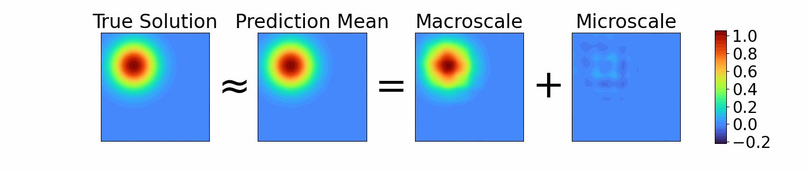
</p>

If the above gif is not rendering, view it [here.](images/burgers_2d/64_5_100_0.0001_2000_augment/test_multiscale.gif)

### Generating data

The dataset is generated by the `gen_data.py` script in the directory `experiments/burgers_2d`. After it finishes running, it produces a file `data_20_5_5.pkl`. This folder already contains the results for all test cases reported in the paper. This will be the dataset our model trains on.

### Training and evaluation

To train a model on this dataset and assess the error, first navigate to the top-level directory `multiscale-visde`, add the pwd to the `PYTHONPATH` environment variable, then execute the following:
```
poetry run python experiments/burgers_2d/run_visde.py
```
This will create a log directory `logs_visde` with model checkpoints. Once training is done, reported error will appear in the directory `postproc_visde`, plots comparing model predictions to observations will appear in `plot_visde`, and plots showing the scale separation will appear in `msplot_visde`. These output folders already contain the results for all test cases reported in the paper. Model hyperparameters and architecture may be modified in `run_visde.py` and `def_model.py` if desired.

## 2D Cylinder Flow

2D cylinder flow dataset, taken from [Guenther et al.](https://cgl.ethz.ch/publications/papers/paperGun17c.php), with domain truncated from 640 x 80 to 320 x 80. The state is a velocity field (2 channels). This is a single-trajectory dataset that covers $t\in [0, 15]$, so the time domain is partitioned into a training interval $[0, 13]$, a validation interval $(13, 14]$, and a test interval $(14, 15]$. Trained for 2000 epochs.
- Original resolution: $n_y = 2\times 320 \times 80 = 51200$
- Macroscale resolution: $n_\zeta = 2\times 32 \times 8 = 512$
- Microscale dimension: $n_\eta \in \{1, ..., 5\}$

### Baseline implicit-scale model

Error on test set: $0.105 \pm 0.001$

<p align="center">
  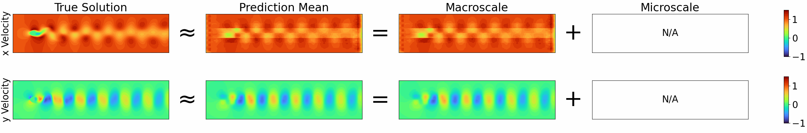
</p>

If the above gif is not rendering, view it [here.](images/cylinder_2d/512_0_2000_0.001_2000/test_multiscale.gif)

### Multiscale model ($n_\eta = 5$)

Error on test set: $0.031 \pm 0.001$

<p align="center">
  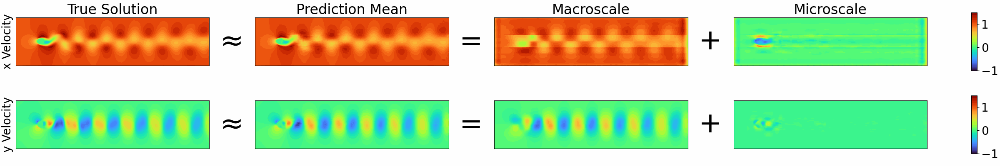
</p>

If the above gif is not rendering, view it [here.](images/cylinder_2d/512_5_2000_0.0001_2000_augment/test_multiscale.gif)

### Assembling data

To assemble the dataset, download the VTK file for the cylinder flow dataset from [here.](https://cgl.ethz.ch/research/visualization/data.php) Unzip it and place the file `cylinder2d.vti` into the folder `experiments/cylinder_2d`. Run `assemble_data.py` to produce a file `data.pkl`. This will be the dataset our model trains on.

### Training and evaluation

To train a model on this dataset and assess the error, first navigate to the top-level directory `multiscale-visde`, add the pwd to the `PYTHONPATH` environment variable, then execute the following:
```
poetry run python experiments/cylinder_2d/run_visde.py
```
This will create a log directory `logs_visde` with model checkpoints. Once training is done, reported error will appear in the directory `postproc_visde`, plots comparing model predictions to observations will appear in `plot_visde`, and plots showing the scale separation will appear in `msplot_visde`. These output folders already contain the results for all test cases reported in the paper. Model hyperparameters and architecture may be modified in `run_visde.py` and `def_model.py` if desired.