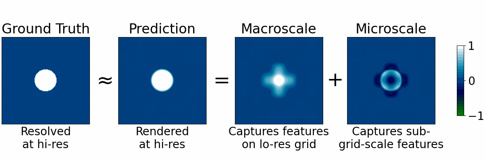

#  Variational Inference of Stochastic Multiscale Models 

### [Preprint](https://arxiv.org/abs/2506.22655) 

[Andrew F. Ilersich](https://www.ilersich.com/), 
[Prasanth B. Nair](http://arrow.utias.utoronto.ca/~pbn)<br>
University of Toronto Institute for Aerospace Studies

This is the official PyTorch implementation of the paper "Learning Stochastic Multiscale Models."


<p align="center">
  
</p>

*Learned stochastic multiscale model of a radial dam break. Our method explicitly separates the dynamics into a coarse macroscale state and a corrective microscale state, which are combined to reconstruct the full, high-resolution flow field.*

## Overview


Simulating physical systems like weather or turbulence is a grand challenge because their dynamics span a vast range of scales. While direct numerical simulation (DNS) resolves these scales with high fidelity, its computational cost is prohibitive for most real-world applications. The standard compromise, closure modeling, simplifies the problem by modeling only a coarse representation of the system. This comes at a cost: the effects of unresolved, sub-grid scales are approximated, and predictions are fundamentally limited to the coarse grid.

**In this work, we introduce a new paradigm for learning stochastic multiscale models  directly from observational data.** Instead of discarding sub-grid information, we explicitly separate the dynamics into a macroscale state on a coarse grid and a microscale state that captures the unresolved dynamics. The temporal evolution of these states is governed by a system of coupled, learned stochastic differential equations (SDEs).

This explicit scale separation allows our model not only to learn the complex interplay between scales but also to reconstruct the **full, high-resolution state**—a key advantage over traditional closure models. Our framework provides a principled, data-driven approach to stochastic multiscale modeling, demonstrating an order-of-magnitude reduction in prediction error compared to implicit-scale data-driven modeling approaches on challenging benchmarks.


## Key Features

- **Explicit scale representation**: Unlike closure models, we directly model both resolved and subgrid-scale dynamics through distinct **macroscale and microscale latent states**.

- **Enforcing scale hierarchy via PoE likelihood**: We employ a product of experts (PoE) likelihood that encourages the macroscale model to explain the bulk of the dynamics while the microscale model provides targeted corrections.

- **Learned stochastic dynamics**: The interactions between scales are governed by a learned system of coupled SDEs, enabling the model to discover the underlying physics from data while inherently quantifying the uncertainty that arises from scale separation and model reduction.

- **Simulator-free stochastic variational inference (SVI)**: We leverage an [amortized SVI scheme](https://github.com/coursekevin/arlatentsde.git)  and the [SVISE reparametrization trick](https://github.com/coursekevin/svise), enabling the ELBO to be maximized  without requiring an SDE solver in the training loop.

- **Generalizable framework**: Our framework is applicable to a broad class of  systems with multiscale spatio-temporal dynamics (e.g., fluids, climate, biology, materials).

## Repository Structure

`datasets/` Code for generating/loading data in each test case

`experiments_refac/` Training scripts and results for all multiscale test cases

`visde/` Core variational inference framework

`multiscale/` Additional modules for multiscale architecture with VISDE

`pyproject.toml` Dependencies managed with Poetry

Each experiment folder contains detailed READMEs with setup instructions, visualizations, and results for the wave equation (1D), KdV equation (1D), Burgers equation (2D), cylinder flow (2D), and radial dam break with shallow water equations (2D).

Our multiscale modeling codebase uses the core inference engine from the [Variational Inference for Stochastic Differential Equations (VISDE)](https://github.com/ailersic/visde.git) PyTorch library.

## Quick Start

```bash
cd ~/path/to/multiscale-visde
export PYTHONPATH=$PYTHONPATH:$(pwd)
poetry install
poetry run python experiments_refac/kdv_1d/run_visde.py
```

## Citation 
```bibtex
@article{Ilersich_Nair_2025_Multiscale,
      title={Learning Stochastic Multiscale Models}, 
      author={Andrew F. Ilersich and Prasanth B. Nair},
      year={2025},
      eprint={2506.22655},
      archivePrefix={arXiv},
      primaryClass={cs.LG},
      url={https://arxiv.org/abs/2506.22655}, 
}
