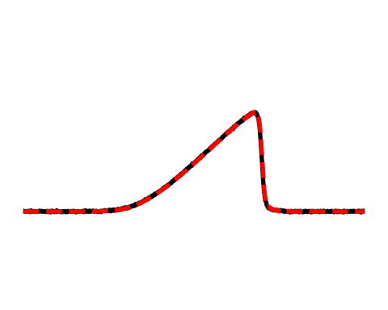

# Stochastic Multiscale Models

This repository accompanies the paper "Learning Stochastic Multiscale Models by Variational Inference," currently under consideration for ICML 2025. It contains the training scripts and results for all test cases presented therein, including additional 2D test cases.

All cases were trained with Adam using an initial learning rate of 0.001 and an exponential decay schedule, such that the learning rate decreases by 10% every 1000 optimization steps. Details of training procedure for each case can be found in the "experiments" directory.

## 2D Cylinder Flow

2D cylinder flow dataset, taken from [Guenther et al.](https://cgl.ethz.ch/publications/papers/paperGun17c.php), with domain truncated from 640 x 80 to 320 x 80. Trained for 2000 epochs.
- Original resolution: 320 x 80
- Macroscale resolution: 32 x 8
- Microscale dimension: {0, ..., 5}

#### Baseline closure model (macroscale only): 12.4% error

#### Multiscale model (microscale state dim = 5, visualized below): 4.9% error

  

## 2D Burgers' Equation

2D Burgers' equation multi-trajectory dataset. Trained for 500 epochs.
- Original resolution: 128 x 128
- Macroscale resolution: 8 x 8
- Microscale dimension: {0, ..., 5}

#### Baseline closure model (macroscale only): 12.7% error

#### Multiscale model (microscale state dim = 5, visualized below): 1.3% error

  

## 1D Korteweg - de Vries Equation

Korteweg - de Vries equation multi-trajectory dataset. Trained for 500 epochs.
- Original resolution: 1000
- Macroscale resolution: 20
- Microscale dimension: {0, ..., 5}

#### Baseline closure model (macroscale only, visualized below): 31.7% error

<table>
  <tr>
    <td align="center" width="20%">
       
      Time = 0.0
    </td>
    <td align="center" width="20%">
       
      Time = 0.25
    </td>
    <td align="center" width="20%">
       
      Time = 0.5
    </td>
    <td align="center" width="20%">
       
      Time = 0.75
    </td>
    <td align="center" width="20%">
       
      Time = 1.0
    </td>
  </tr>
</table>

#### Multiscale model (microscale state dim = 5, visualized below): 5.8% error

<table>
  <tr>
    <td align="center" width="20%">
       
      Time = 0.0
    </td>
    <td align="center" width="20%">
       
      Time = 0.25
    </td>
    <td align="center" width="20%">
       
      Time = 0.5
    </td>
    <td align="center" width="20%">
       
      Time = 0.75
    </td>
    <td align="center" width="20%">
       
      Time = 1.0
    </td>
  </tr>
</table>

## 1D Burgers' Equation

1D Burgers' equation multi-trajectory dataset. Trained for 500 epochs.
- Original resolution: 1000
- Macroscale resolution: 20
- Microscale dimension: {0, ..., 5}

#### Baseline closure model (macroscale only, visualized below): 10.5% error

<table>
  <tr>
    <td align="center" width="20%">
       
      Time = 0.0
    </td>
    <td align="center" width="20%">
       
      Time = 0.25
    </td>
    <td align="center" width="20%">
       
      Time = 0.5
    </td>
    <td align="center" width="20%">
       
      Time = 0.75
    </td>
    <td align="center" width="20%">
       
      Time = 1.0
    </td>
  </tr>
</table>

#### Multiscale model (microscale state dim = 5, visualized below): 1.1% error

<table>
  <tr>
    <td align="center" width="20%">
       
      Time = 0.0
    </td>
    <td align="center" width="20%">
       
      Time = 0.25
    </td>
    <td align="center" width="20%">
       
      Time = 0.5
    </td>
    <td align="center" width="20%">
       
      Time = 0.75
    </td>
    <td align="center" width="20%">
       
      Time = 1.0
    </td>
  </tr>
</table>

