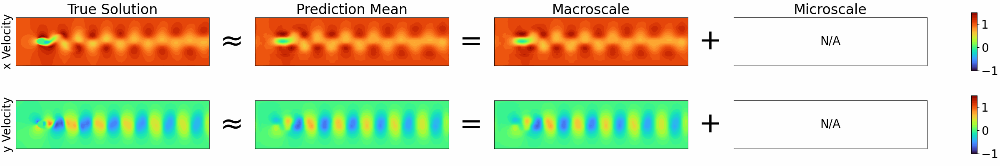
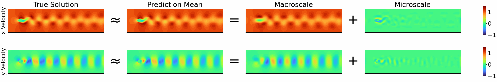

## 2D Cylinder Flow

2D cylinder flow dataset, taken from [Guenther et al.](https://cgl.ethz.ch/publications/papers/paperGun17c.php), with domain truncated from 640 x 80 to 320 x 80. The state is a velocity field (2 channels). This is a single-trajectory dataset that covers $t\in [0, 15]$, so the time domain is partitioned into a training interval $[0, 13]$, a validation interval $(13, 14]$, and a test interval $(14, 15]$. Trained for 2000 epochs.
- Original resolution: $n_y = 2\times 320 \times 80 = 51200$
- Macroscale resolution: $n_\zeta = 2\times 32 \times 8 = 512$
- Microscale dimension: $n_\eta \in \{1, ..., 5\}$

Error mean $\pm$ standard deviation on test set:

| Coarse DNS        | DMD               | POD-SINDy         | Implicit-scale    | Multiscale $(n_\eta=5)$ | 
| ----------------- | ----------------- | ----------------- | ----------------- | ----------------------- |
| $0.130 \pm 0.040$ | $0.016 \pm 0.006$ | $0.051 \pm 0.024$ | $0.063 \pm 0.005$ | $0.009 \pm 0.001$       |

Implicit-scale and multiscale model predictions are shown below.

### Baseline implicit-scale model

Error on test set: $0.063 \pm 0.005$

<p align="center">
  
</p>

If the above gif is not rendering, view it [here.](../../images/cylinder_2d/data_512_0_64_2_1_1000_0.001_2000/anim.gif)

### Multiscale model ($n_\eta = 5$)

Error on test set: $0.009 \pm 0.001$

<p align="center">
  
</p>

If the above gif is not rendering, view it [here.](../../images/cylinder_2d/data_512_5_64_2_1_1000_0.0001_2000_augment/anim.gif)

### Assembling data

To assemble the dataset, download the VTK file for the cylinder flow dataset from [here.](https://cgl.ethz.ch/research/visualization/data.php) Unzip it and place the file `cylinder2d.vti` into the folder `datasets/cylinder_2d`. Run `assemble_data.py` to produce a file `data.pkl`. This will be the dataset our model trains on.

### Training and evaluation

To train a model on this dataset and assess the error, first navigate to the top-level directory `multiscale-visde`, add the pwd to the `PYTHONPATH` environment variable, then execute the following:
```
poetry run python experiments_refac/cylinder_2d/run_visde.py
```
This will create a log directory `logs_visde` with model checkpoints. Once training is done, reported error will appear in the directory `postproc_visde`. The remaining scripts are largely for plotting: `comparison_plot.py` generates plots comparing model predictions to observations in `plot_visde`, and `multiscale_plot.py` generates plots showing the scale separation in `msplot_visde`. These output folders already contain the results for all test cases reported in the paper, so re-running these scripts is not necessary. Model hyperparameters and architecture may be modified in `run_visde.py`, `utils.py`, and `def_model.py` if desired.
