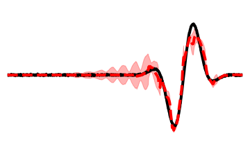
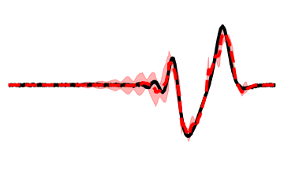
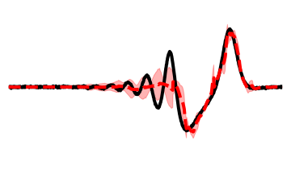
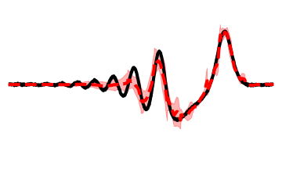
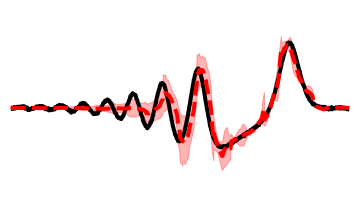
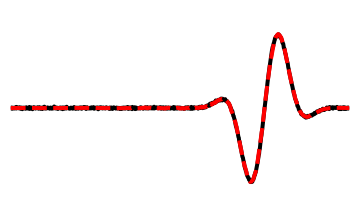
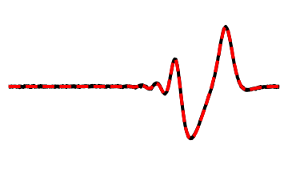
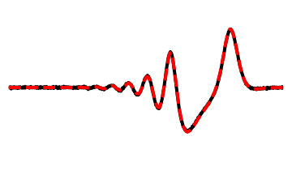
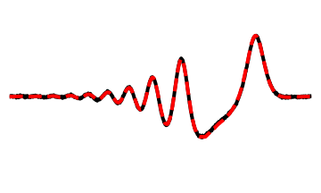
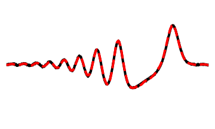

## 1D Korteweg - de Vries Equation

Korteweg - de Vries equation multi-trajectory dataset. Training set contains 10 trajectories, validation contains 5, test contains 5. Trained for 100 epochs.
- Original resolution: $n_y = 1000$
- Macroscale resolution: $n_\zeta = 20$
- Microscale dimension: $n_\eta \in \{1, ..., 5\}$

Error mean $\pm$ standard deviation on test set:

| Coarse DNS        | DMD               | POD-SINDy         | Implicit-scale    | Multiscale $(n_\eta=5)$ | 
| ----------------- | ----------------- | ----------------- | ----------------- | ----------------------- |
| $0.523 \pm 0.196$ | $0.163 \pm 0.046$ | $0.057 \pm 0.028$ | $0.324 \pm 0.078$ | $0.042 \pm 0.017$       |

Implicit-scale and multiscale model predictions are shown below.

### Baseline implicit-scale model

Error on test set: $0.324 \pm 0.078$

<div align="center">

<table>
  <tr>
    <td align="center" width="20%">
      <br/>
      <sub>Time = 0.0</sub>
    </td>
    <td align="center" width="20%">
      <br/>
      <sub>Time = 0.25</sub>
    </td>
    <td align="center" width="20%">
      <br/>
      <sub>Time = 0.5</sub>
    </td>
    <td align="center" width="20%">
      <br/>
      <sub>Time = 0.75</sub>
    </td>
    <td align="center" width="20%">
      <br/>
      <sub>Time = 1.0</sub>
    </td>
  </tr>
</table>

</div>

If the above plots are not rendering, view them [here.](../../images/kdv_1d/data_10_5_5_20_0_64_2_1_100_0.001_2000/)

### Multiscale model ($n_\eta = 5$)

Error on test set: $0.042 ± 0.017$

<div align="center">

<table>
  <tr>
    <td align="center" width="20%">
      <br/>
      <sub>Time = 0.0</sub>
    </td>
    <td align="center" width="20%">
      <br/>
      <sub>Time = 0.25</sub>
    </td>
    <td align="center" width="20%">
      <br/>
      <sub>Time = 0.5</sub>
    </td>
    <td align="center" width="20%">
      <br/>
      <sub>Time = 0.75</sub>
    </td>
    <td align="center" width="20%">
      <br/>
      <sub>Time = 1.0</sub>
    </td>
  </tr>
</table>

</div>

If the above plots are not rendering, view them [here.](../../images/kdv_1d/data_10_5_5_20_5_64_2_1_100_0.0001_2000_augment/)

### Generating data

The dataset is generated by the `gen_data.py` script in the directory `datasets/kdv_1d`. After it finishes running, it produces a file `data_10_5_5.pkl`. This will be the dataset our model trains on.

### Training and evaluation

To train a model on this dataset and assess the error, first navigate to the top-level directory `multiscale-visde`, add the pwd to the `PYTHONPATH` environment variable, then execute the following:
```
poetry run python experiments_refac/kdv_1d/run_visde.py
```
This will create a log directory `logs_visde` with model checkpoints. Once training is done, reported error will appear in the directory `postproc_visde`. The remaining scripts are largely for plotting: `comparison_plot.py` generates plots comparing model predictions to observations in `plot_visde`, and `multiscale_plot.py` generates plots showing the scale separation in `msplot_visde`. These output folders already contain the results for all test cases reported in the paper, so re-running these scripts is not necessary. Model hyperparameters and architecture may be modified in `run_visde.py`, `utils.py`, and `def_model.py` if desired.