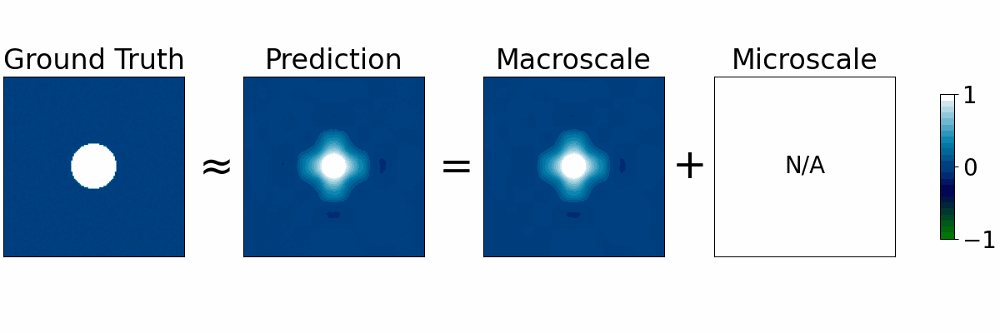
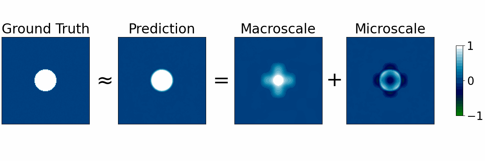

## 2D Shallow Water Equations

2D radial dam break dataset modelled with shallow water equations, taken from PDEBench ([Takamoto et al.](https://arxiv.org/abs/2210.07182)). This is a multi-trajectory dataset. Training set contains 900 trajectories, validation contains 50, test contains 50. Trained for 20 epochs.
- Original resolution: $n_y = 128 \times 128 = 16384$
- Macroscale resolution: $n_\zeta = 8 \times 8 = 64$
- Microscale dimension: $n_\eta \in \{1, ..., 5\}$

Error mean $\pm$ standard deviation on test set:

| Coarse DNS        | DMD               | POD-SINDy         | Implicit-scale    | Multiscale $(n_\eta=5)$ | 
| ----------------- | ----------------- | ----------------- | ----------------- | ----------------------- |
| $0.861 \pm 0.190$ | $0.531 \pm 0.227$ | $0.535 \pm 0.210$ | $0.426 \pm 0.099$ | $0.152 \pm 0.047$       |

Implicit-scale and multiscale model predictions are shown below.

### Baseline implicit-scale model

Error on test set: $0.426 \pm 0.099$

<p align="center">
  
</p>

If the above gif is not rendering, view it [here.](../../images/shallow_water_2d/data_900_50_50_noisy_64_0_64_2_1_20_0.001_2000/anim.gif)

### Multiscale model ($n_\eta = 5$)

Error on test set: $0.152 \pm 0.047$

<p align="center">
  
</p>

If the above gif is not rendering, view it [here.](../../images/shallow_water_2d/data_900_50_50_noisy_64_5_64_2_1_20_0.0001_2000_augment/anim.gif)

### Assembling data

To assemble the dataset, download the `.h5` file for the shallow water dataset from [here.](https://darus.uni-stuttgart.de/api/access/datafile/133021) Place the file (either named `133021.h5` or `2D_rdb_NA_NA.h5` depending on download method) into the folder `datasets/shallow_water_2d`. Run `assemble_data.py` (you might need to modify the input file name on line 12) to produce a file `data_900_50_50_noisy.pkl`. This will be the dataset our model trains on.

### Training and evaluation

To train a model on this dataset and assess the error, first navigate to the top-level directory `multiscale-visde`, add the pwd to the `PYTHONPATH` environment variable, then execute the following:
```
poetry run python experiments_refac/shallow_water_2d/run_visde.py
```
This will create a log directory `logs_visde` with model checkpoints. Once training is done, reported error will appear in the directory `postproc_visde`. The remaining scripts are largely for plotting: `comparison_plot.py` generates plots comparing model predictions to observations in `plot_visde`, and `multiscale_plot.py` generates plots showing the scale separation in `msplot_visde`. These output folders already contain the results for all test cases reported in the paper, so re-running these scripts is not necessary. Model hyperparameters and architecture may be modified in `run_visde.py`, `utils.py`, and `def_model.py` if desired.
